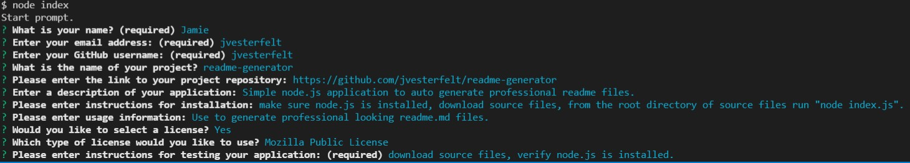

# README-GENERATOR
    
## Description
Simple node.js application designed to automatically generate a professional looking README.md file using the inquirer package. This is designed to demonstrate the capabilities of javascript to interact with both the file system and the user to generate content.
    
## Table of Contents
* [Installation](#Installation)
* [Usage](#Usage)
* [License](#License)
* [Contributing](#Contributing)
* [Testing](#Testing)
* [Questions](#Questions)    
    
## Installation
1. Verify that node.js is installed 2. clone the source files 3. install the inquirer package
    
## Usage
Run the application from the root directory of the source files using "node index.js", screenshots provided in ./assets/images.
    
#### Usage Screenshots:

    
#### Walkthrough video: 

    

## License

[MIT license details](https://choosealicense.com/licenses/mit/)
    
## Contributing
Before contributing to this project please review the Contributor Covenant Code of Conduct:
[Contributor Covenant Code of Conduct](https://www.contributor-covenant.org/version/2/0/code_of_conduct/code_of_conduct.md)
    
## Testing
There is a second script file created called testIndex.js. Run this file using "node testIndex.js" and a sample of the README.md file will be logged to the console.
    
## Questions
    
Please direct all questions to Jamie Vesterfelt:
    
Email: jamievesterfelt@hotmail.com
    
GitHub: https://github.com/jvesterfelt
    
Repository: https://github.com/jvesterfelt/readme-generator

    
    
Copyright (c) 2021 Jamie Vesterfelt

